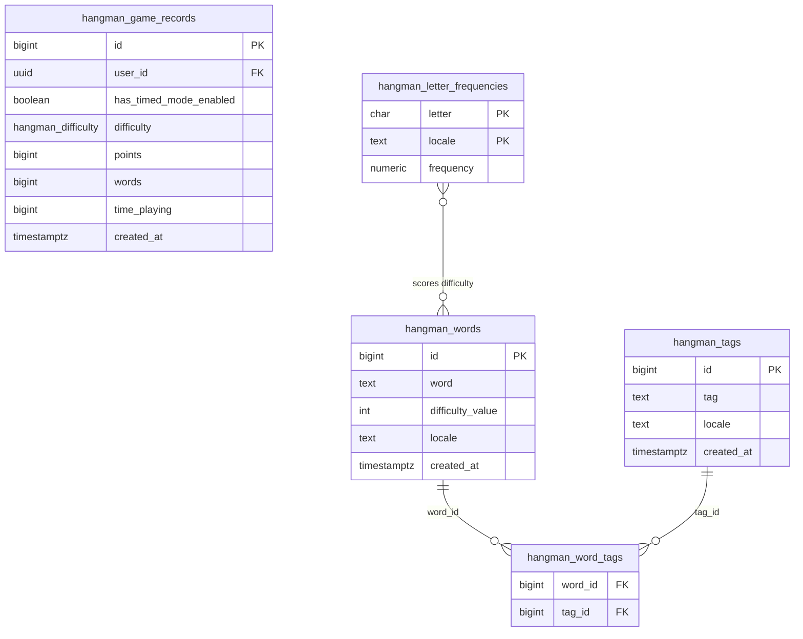

# Hangman

Word-guessing game in English and Spanish with timed mode and a shared leaderboard. Supabase handles auth, the word list, and game records.

Flutter **3.47.2** (see [`.tool-versions`](.tool-versions)). Android/iOS package: `io.github.danny270793.hangman`.

## Quick start

```sh
cp .env.example.json .env.json   # then fill in real values
asdf exec flutter pub get
asdf exec flutter run --dart-define-from-file=.env.json
```

## Documentation

- [Run on an emulator or device](docs/getting-started.md)
- [Fill `.env.json`](docs/environment.md)
- [Sync Xcode and publish to the App Store](docs/app-store.md)
- [Bump app version and Flutter SDK](docs/versioning.md)

## Database (Supabase)

This repo has the app only. The `hangman_*` schema and the word list live in [danny270793/supabase](https://github.com/danny270793/supabase), the source of truth for migrations. Hangman shares that Supabase project with the other apps. To change the database you need both repos:

```sh
git clone git@github.com:danny270793/Hangman.git
git clone git@github.com:danny270793/supabase.git
```

Create, test, and push migrations from the `supabase` repo. To add, remove, or retag words, add a migration there; the difficulty trigger scores new words automatically. This repo ignores any `supabase/` folder, and `.env.json` holds the project credentials, so never commit it.



The app reads `hangman_words_with_tags` and `hangman_game_records_with_usernames` (views) and inserts into `hangman_game_records`. See the [schema docs](https://github.com/danny270793/supabase/tree/main/docs/hangman).

## Agents

See [AGENTS.md](AGENTS.md) (Claude: [CLAUDE.md](CLAUDE.md)).
